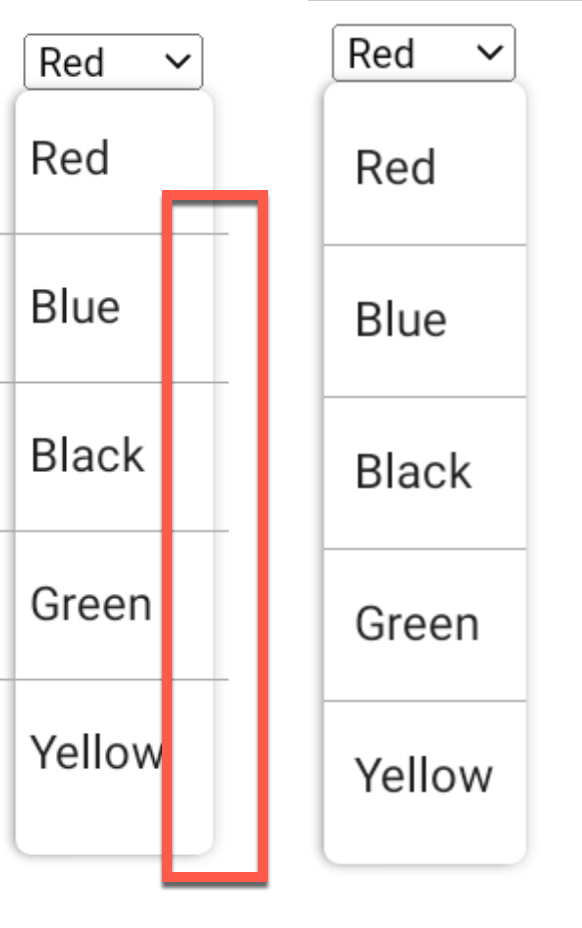

This project is written for Android bug reporting.  
When I set `fitsSystemWindows` to ***true***, it breaks select tag's dropdown design on tablet.

[Stackoverflow question](https://stackoverflow.com/questions/74781596/fitssystemwindows-true-cracks-select-dropdown-design-in-android-webview)

